# Gene-signature-based-compound-identification
Identify gene biomarkers to improve the prediction of treatment responses and compounds for combination therapy

### Author: Curtis Lin

---------------

## 1. Justification

​Breast cancer is a prevalent and often invasive cancer. Approximately 1 and 8
women and 1 and 1000 men in the United States suffer from invasive forms of breast
cancer (1). In 2018, approximately 40,000 women are expected to die from breast
cancer (1). To reduce the prevalence and mortality rates caused by breast cancer
scientists need to identify the risk factors associated with cancer development. As of
now, age and race provide informative risk factors that can help predict and ultimately
treat breast cancer (1). Additionally, between 5-10% of breast cancers are hereditary
and therefore might be predicted from genetic information (2). The goal of this project
was to identify some of the genes that are up- or downregulated in response to positive
or negative responses to breast cancer treatment. More specifically, a public dataset
comprised of 3 separate files was obtained from (3). Expression of approximately
20,000 genes from patients with stages I-III breast cancer were measured after a
positive response to chemotherapy (pCR: pathological complete response), where no
cancer was recovered, or a negative response (RD: residual invasive cancer) where
residual invasive cancer was detected.

## 2. Goals

- Identify a gene signature which associates with patient response to treatment.
- Examine whether gene signature can improve the prediction of treatment response. 
- Identify drugs or compounds which can be combine with TFAC treatment to improve pathologic complete response in patients.   

## 3. R and Packages
- R version 4.0.2
- GEOquery 2.56.0
- ggplot2 3.3.2
- tidyr 1.1.1
- dplyr 1.0.1
- limma 3.44.3
- factoextra 1.0.7.999
- cluster 2.1.0
- ggfortify 0.4.10
- caret 6.0.86
- ROCR 1.0.11
- e1071 1.7.3

## 4. Exploratory Data Analysis

### (a) Age

 - Age distributions among different races show no significant difference. 
 - Age distributions between treatment response show no significant difference. 
 > 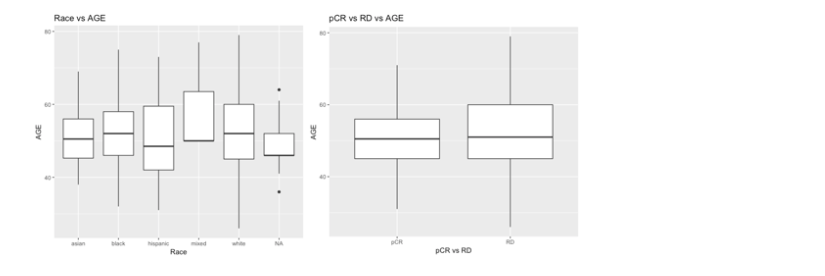

- Age distributions among groups in BMN grade and N stage before show no significant difference. The age distribution at T stage = 0 is not statistical significant in the comparison with other T stages (two-tailed t test; T stage 0 vs T stage 1 = 0.064, T stage 0 vs T stage 2 = 0.108, T stage 0 vs T stage 3 = 0.063, T stage 0 vs T stage 4 = 0.094)

> 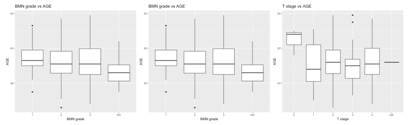

- Age distributions among groups in difference molecular characteristics (ER/PR/HER2 status) show no significant difference.

> 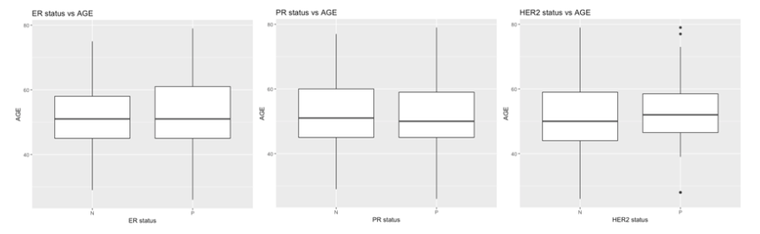

### (b) Microarray data normalization

- To remove technical variation of microarray data, quantile normalization is applied to make distribution are identical in statistical properties. 
> 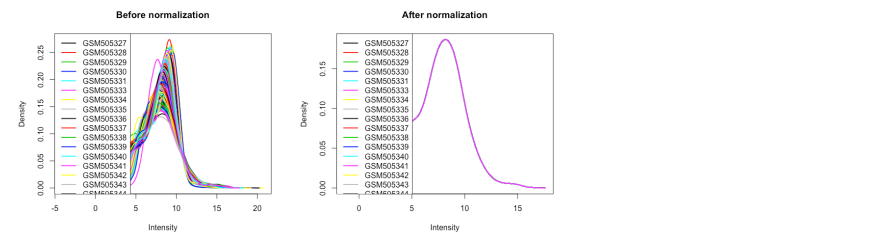

### (c) Identify similar groups of patients 

- Cluster analysis is conducted with k-means clustering. Here, Silhouette method is used to estimate the optimal number of clusters. From the plot, the blue group exhibits high similarities in transcriptome profiles, but the yellow group is not.

> 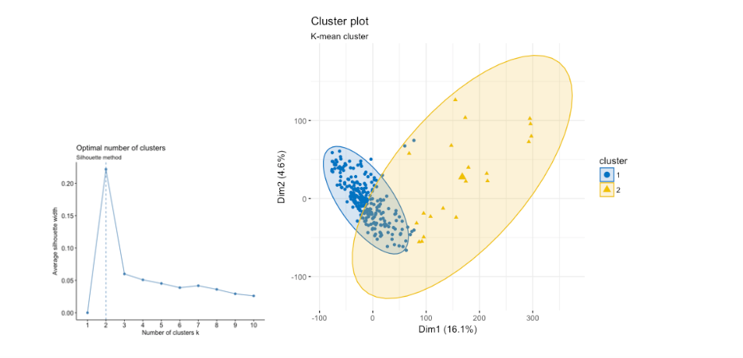

- With surveying different clinical parameters of patients, MAQC_Distribution_Status is the strongest distinguishing feature between the groups. The MAQC_Q group is similar to the yellow group in k-means clustering and the group 4-6 in CLARA. Because MAQC_Q microarray data shows big variations compared to MAQC_T and MAQC_V, MAQC_Q data was not used for following analysis to avoid the bias of results. In addition, MDA_R data is microarray repeats of subset of patients. Therefore, MDA_R data was also removed.    

> 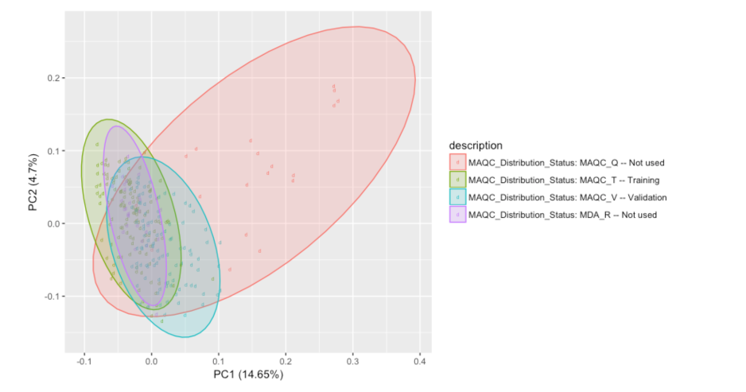

### (d) Compare ER/PR/HER2 status against the treatment response

- The transcriptome profiles are accessed based on treatment responses in patients and ER/PR/HER2 status. 
- Based on the visualization of plots, TFAC treatment is more effective in ER negative breast cancer patients.

> 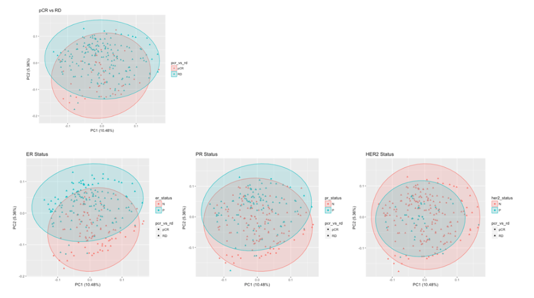

## 5. Generate machine learning models to predict the treatment responses

### (a) Use supervised learning model to predict response based on ER status

- The supervised learning is used to predict treatment response (pCR vs RD) based on ER status (ER positive and ER negative) in microarray data. A non-parametric method (k-nearest neighbors algorithm) and a probabilistic binary linear classifier (support vector machine) are selected to generate prediction model and the performance of prediction models were further assessed with testing data set. 

- The model which was built from non-parametric k-nearest neighbors (K-NN) algorithm shows good prediction of treatment response based on ER status in testing data set (Validation Data Set). 

> 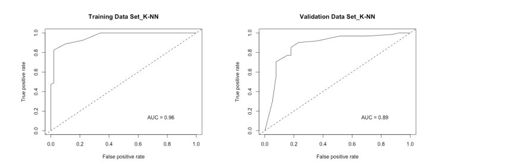

- The model which was built from support vector machine (SVM) shows worse performance than K-NN model and overfitting.   

> 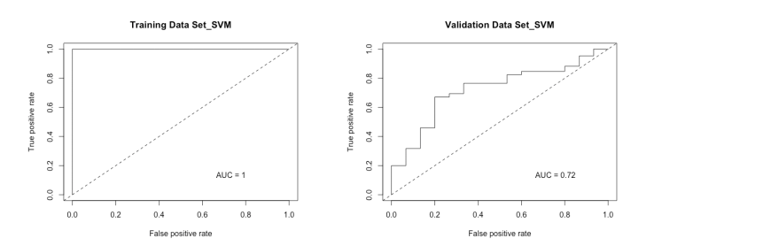

### (b) Identify a gene signature which associates with patient response to treatment (pCR vs RD).

- Gene signature of pCR is selected with adjusted p-value < 1e-04 (commonly use adjusted p-value < 0.05 or 0.01). The reason for using adjusted p-value < 1e-04  to siselect small number of genes with good representation to therapeutic outcomes; furthermore, potentially developing assays for companion diagnostics. In addition, ER gene (ESR1) is the most significant gene that associated with pCR (highlight in yellow).

- pCR signature contains 57 genes

- [pCR Gene Signature](Gene_signature.pdf)

- pCR gene signature is sufficient to distinguish pCR and RD in patient. The signature can also distinguish ER+ and ER-.

> 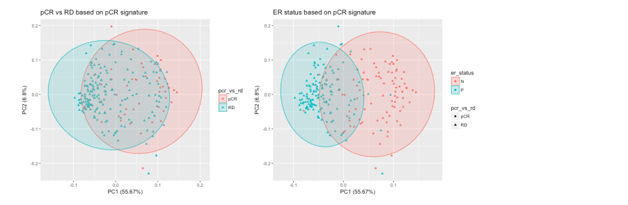

### (c) Improve the prediction accuracy with pCR gene signature

- Both K-NN and SVM models which were built based on pCR signature improve the accuracy of prediction. The AUC increases from 0.89 to 0.92 in K-NN-based model. The AUC increases from 0.72 to 0.94 in SVM-based model.

> 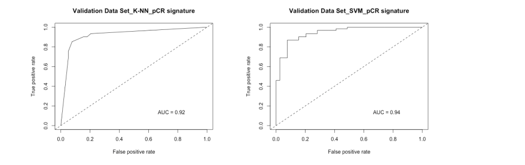

## 6. Identify drugs or compounds which can be combined with TFAC treatment to improve pathologic complete response in patients

- The pCR gene signature was applied to [CONNECTIVITY MAP](https://www.broadinstitute.org/connectivity-map-cmap) (MIT Broad Institute) for identifying drugs or compounds that can potentially be combined with TFAC treatment to enhance the therapeutic efficacy in RD patients (ER+ breast cancer patients). The results suggest using cell cycle inhibitors (CDK inhibitors and topoisomerase inhibitors) or PI3K/AKT/mTOR signaling inhibitors are good drug candidates. 

> 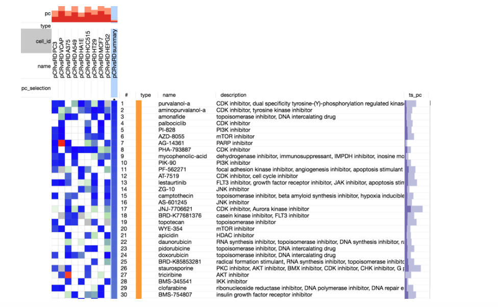

7. Summary

- Gene biomarkers not only improve the prediction accuracy and prevent overfitting situation; furthermore, identifying drugs or compounds for combination therapy to improve treatment responses. 